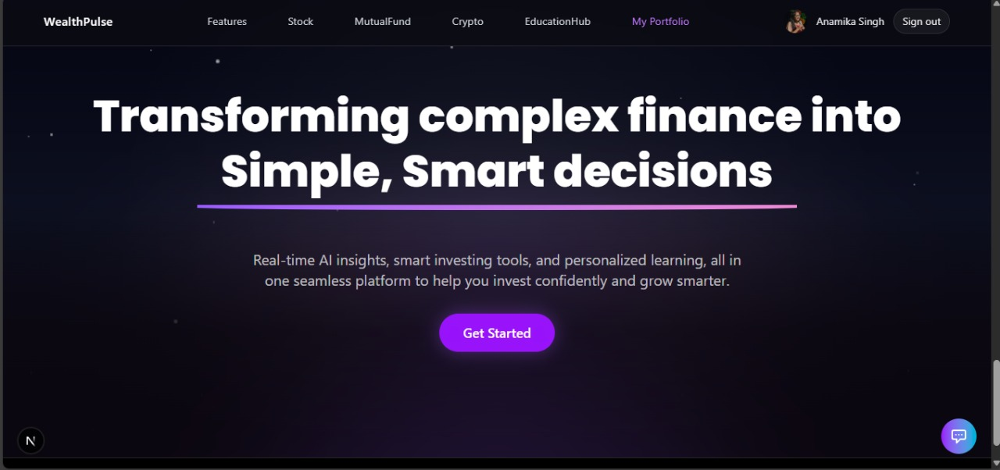
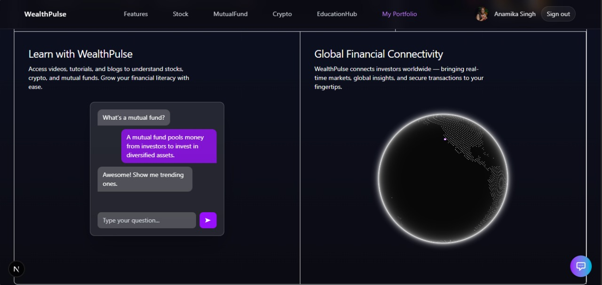
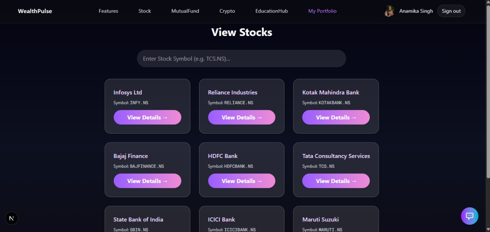
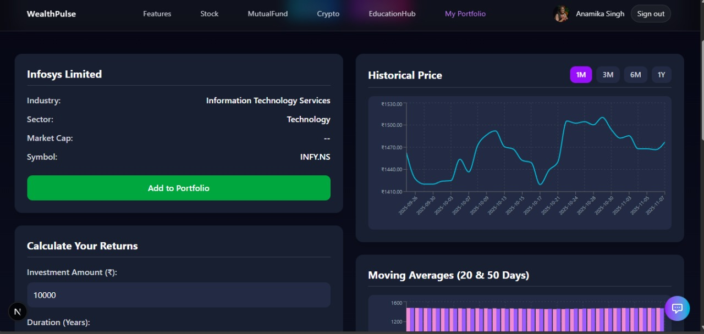
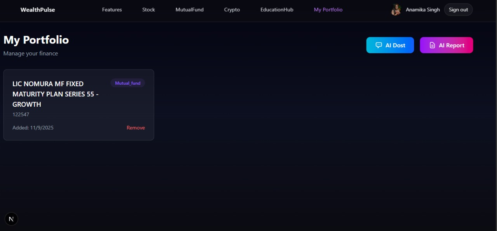

# NiveshAI

> **Transforming complex finance into simple, smart decisions**

NiveshAI is a comprehensive fintech platform that combines **AI-powered insights**, **real-time portfolio tracking**, and **educational resources** to help investors make smarter financial decisions across **stocks**, **mutual funds**, and **cryptocurrencies**.

---

## ✨ Key Features

### 🤖 AI-Powered Investment Intelligence
- **AI Insights:** Personalized investment recommendations powered by **Google Gemini 2.0 Flash**
- **Portfolio Analysis:** Comprehensive, AI-driven risk and trend assessment  
- **Smart Chatbot:** Interactive financial assistant for instant support  
- **Auto Reports:** Automatically generated portfolio insights with metrics and recommendations  

### 📊 Real-Time Portfolio Management
- **Multi-Asset Tracking:** Manage stocks, mutual funds, and crypto in one dashboard  
- **Live Data Integration:** Real-time market updates and price monitoring  
- **Portfolio Analytics:** Performance tracking, volatility analysis, and Sharpe ratios  
- **Automated Risk Assessment:** Categorizes risk and volatility levels  

### 🎓 Financial Education Hub
- **Courses & Tutorials:** Beginner-to-advanced modules on stocks, crypto, and mutual funds  
- **Video & Blog Content:** Expert insights and interactive learning  
- **Guided Learning Paths:** Progressive education for improving financial literacy  

### 🔐 Secure Authentication
- **Auth0 Integration:** Enterprise-grade authentication and authorization  
- **Personalized Portfolios:** Securely linked to user profiles  
- **Data Protection:** End-to-end encrypted storage of user financial data  

---

## 🛠️ Tech Stack

| **Layer** | **Technology** | **Purpose** |
|------------|----------------|--------------|
| **Frontend** | Next.js 15.5.3, React 19.1.0, TypeScript, Tailwind CSS 4.1.16, Framer Motion, Recharts | UI development, animations, and responsive data visualization |
| **Backend** | FastAPI (Python), MongoDB | API services, data persistence, and analytics |
| **AI Integration** | Google Gemini 2.0 (via OpenRouter API) | Personalized investment intelligence |
| **Authentication** | Auth0 | Secure login and identity management |
| **Visualization** | Recharts, Framer Motion | Real-time charts and animated interfaces |
| **Communication** | Axios | API requests and backend interaction |
| **Icons & UI** | Lucide React, shadcn/ui | Consistent and modern UI components |
| **Deployment** | Vercel, FastAPI Hosting | Frontend + backend deployment environment |

---


## 🚀 Getting Started

### Prerequisites
- Node.js 18+ 
- Python 3.8+
- MongoDB instance
- OpenRouter API key
- Auth0 account

### Environment Variables

Create a `.env.local` file in the root directory:

```env
# Auth0 Configuration
AUTH0_SECRET=your_auth0_secret
AUTH0_BASE_URL=http://localhost:3000
AUTH0_ISSUER_BASE_URL=https://your-domain.auth0.com
AUTH0_CLIENT_ID=your_client_id
AUTH0_CLIENT_SECRET=your_client_secret

# OpenRouter AI
OPENROUTER_API_KEY=your_openrouter_api_key

# MongoDB
MONGODB_URI=your_mongodb_connection_string
```

### Frontend Setup

```bash
# Install dependencies
npm install

# Run development server
npm run dev
```

### Backend Setup

```bash
# Navigate to backend directory
cd backend

# Install Python dependencies
pip install -r requirements.txt

# Run FastAPI server
python -m uvicorn main:app --reload
```

Open [http://localhost:3000](http://localhost:3000) to view the application.

## 📁 Project Structure

```
niveshai/
├── app/                          # Next.js App Router
│   ├── components/              # React components
│   │   ├── Navbar.jsx
│   │   ├── Hero.jsx
│   │   ├── Chatbot.jsx
│   │   └── ...
│   ├── api/                     # API routes
│   │   ├── ai/                  # AI-powered endpoints
│   │   ├── auth/                # Authentication
│   │   ├── portfolio/           # Portfolio management
│   │   └── chat/                # Chatbot API
│   ├── StockDashboard/          # Stock tracking pages
│   ├── CryptoDashboard/         # Crypto tracking pages
│   ├── MFDashboard/            # Mutual fund pages
│   ├── Portfolio/               # Portfolio management
│   └── Courses/                 # Educational content
├── backend/                     # FastAPI backend
│   ├── main.py                  # FastAPI application
│   ├── stock_api.py            # Stock data API
│   ├── crypto_api.py           # Crypto data API
│   ├── mf_api.py               # Mutual fund API
│   └── portfolio_mongodb.py    # Portfolio management
├── components/                  # Shared UI components
├── lib/                        # Utility functions
└── public/                     # Static assets
```

## 🔗 API Endpoints

### AI Services
- `POST /api/ai/generate-report` - Generate AI portfolio reports
- `POST /api/ai/summarize` - Summarize financial data
- `POST /api/chat` - Chatbot interactions

### Portfolio Management
- `GET /api/portfolio/[userId]` - Get user portfolio
- `POST /api/portfolio/add/[userId]` - Add portfolio item
- `PUT /api/portfolio/[userId]/[itemId]` - Update portfolio item

### Authentication
- `/api/auth/[auth0]` - Auth0 authentication endpoints

## 🖼️ Screenshots

### Landing Page



### Stocks Component



### Portfolio


### Education  Hub


## 🎯 Key Features in Detail

### AI-Powered Analysis
NiveshAI leverages Google Gemini 2.0 Flash through OpenRouter to provide:
- Risk assessment and volatility analysis
- Personalized investment recommendations
- Market trend analysis
- Portfolio optimization suggestions

### Multi-Asset Support
Track and analyze:
- **Stocks**: Real-time prices, technical indicators
- **Mutual Funds**: NAV tracking, fund performance
- **Cryptocurrencies**: Price movements, market cap

### Educational Platform
- Interactive courses on financial literacy
- Video tutorials and guides
- Blog content on investment strategies
- Beginner to advanced learning paths

## 🔧 Available Scripts

```bash
npm run dev      # Start development server with Turbopack
npm run build    # Build for production with Turbopack
npm run start    # Start production server
npm run lint     # Run ESLint
```

## 🚀 Deployment

### Vercel 
1. Connect your GitHub repository to Vercel
2. Configure environment variables
3. Deploy with automatic CI/CD

### Manual Deployment
1. Build the application: `npm run build`
2. Deploy the `.next` folder to your hosting provider
3. Set up the FastAPI backend on your preferred cloud platform

## 🤝 Contributing

1. Fork the repository
2. Create a feature branch: `git checkout -b feature/amazing-feature`
3. Commit your changes: `git commit -m 'Add amazing feature'`
4. Push to the branch: `git push origin feature/amazing-feature`
5. Open a Pull Request

## 📄 License

This project is private and proprietary.

## 🆘 Support

For support and questions:
- Open an issue on GitHub
- Contact the development team
- Check the documentation in `/docs`

---

Built with ❤️ by PHOENIX ARCANA 🐦‍🔥
